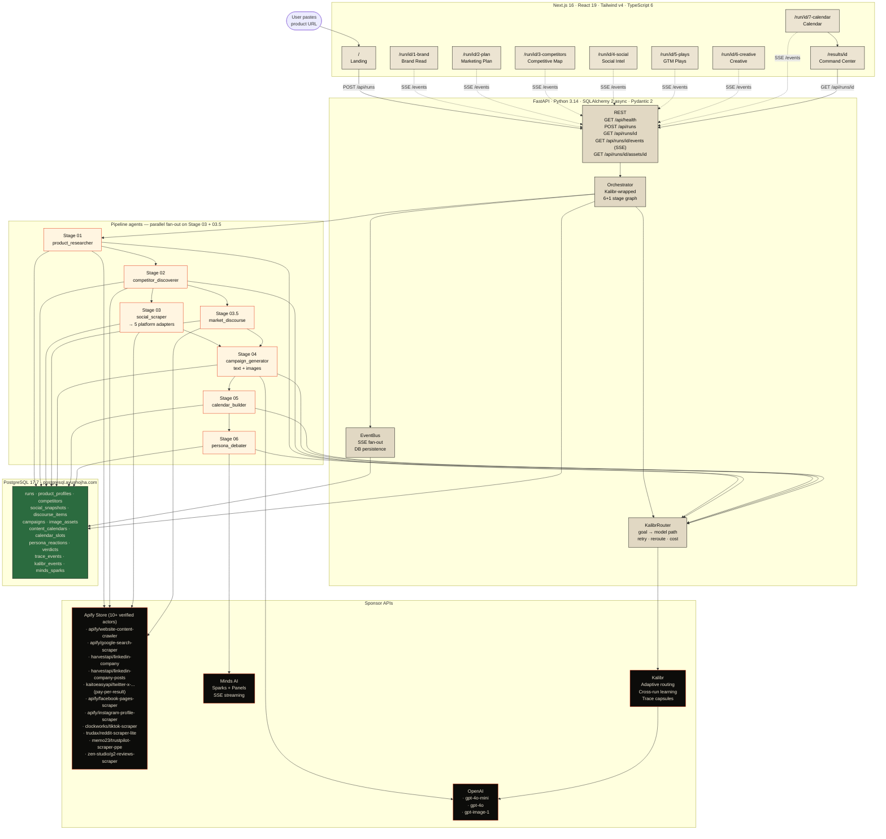
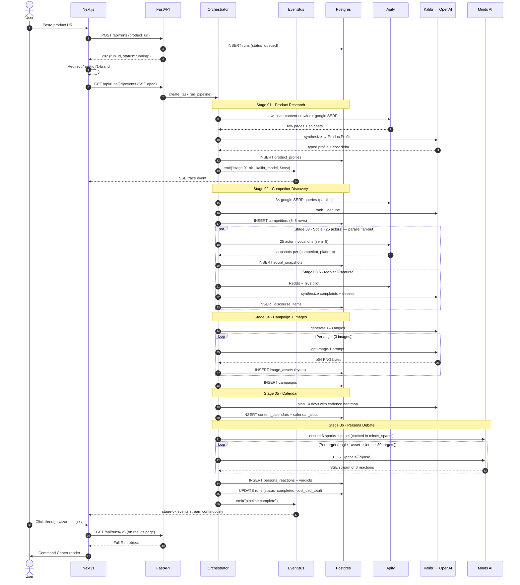

# Shadow Launch

**A GTM strategy simulator. Drop in a product URL. Get a synthetic twin of your market, a pressure-tested campaign, and a fourteen-day content calendar — every idea validated by a panel of six synthetic buyer personas before you launch.**

> Rehearse your launch against a synthetic twin of your market before you touch the real one.

Built for the **Marketing Agents Hackathon · Entrepreneurs First SF · 2026-04-18**.

---

## What it does

You hand Shadow Launch a single URL. Seven stages run in parallel and sequence:

1. **Brand Read** — Apify crawls your site; OpenAI synthesizes a positioning profile.
2. **Competitor Discovery** — Apify Google SERP (3 queries) + Product Hunt + G2; Kalibr ranks the 5–8 strongest competitors.
3. **Social Intelligence** — 25 Apify actors fan out across LinkedIn · X · Facebook · Instagram · TikTok, one per (competitor × platform).
4. **Market Discourse** (3.5) — Reddit + Trustpilot scraping surface the top complaints and desires.
5. **Campaign Generation** — OpenAI `gpt-4o` drafts 1–3 angles; `gpt-image-1` produces 3 images per angle.
6. **Content Calendar** — 14-day multi-channel schedule, cadence-aware against competitor posting patterns.
7. **Persona Debate** — **Minds AI Panels** stream reactions from 6 synthetic buyer personas (Marketing VP · CFO Skeptic · Engineering Lead · Target End-User · Social Media Manager · PR/Brand Authority). Weighted consensus per asset; dissent heat map on the ones flagged for rework.

Every LLM + image call is routed through **Kalibr**. Cost ticker surfaces live, model attribution stamps every output, reroutes show up in the trace.

Output is a shareable **Command Center** page with 9 sections: product profile, competitor grid, social traction comparison, creative gallery (real PNG bytes streamed from Postgres), calendar, debate transcripts, action-required list, Kalibr summary, export actions.

---

## Highlights

- **No dummy data outside `/demo`.** Every production pageload hits real Apify / OpenAI / Minds / Kalibr APIs or surfaces a real error state.
- **Real database.** PostgreSQL 17 with direct TLS. `shadowlaunch` schema has 14 tables + alembic migrations.
- **6-persona jury.** Minds plan tier verified Premium+. Panels API drives Round 1 reactions via SSE; optional Round 2 rebuttals behind `MINDS_ROUND_2=1`.
- **Real images.** `gpt-image-1` bytes persisted as `bytea` in Postgres, streamed via `/api/runs/{id}/assets/{asset_id}`.
- **Live cost tracking.** Every Kalibr call reports prompt/completion tokens → estimated USD → aggregated on `runs.cost_usd_total`.
- **Wizard flow.** 7 stage pages with a persistent jury rail + streaming trace readout. Deep-linkable, keyboard-nav (`← → Esc`), progress-preserved.

---

## Architecture

<p align="center">
  
</p>

<sub>Source: <a href="docs/architecture.mmd"><code>docs/architecture.mmd</code></a> (Mermaid). Regenerate with <code>npx -y -p @mermaid-js/mermaid-cli@latest mmdc -i docs/architecture.mmd -o docs/architecture.svg -b '#ece4d2' --width 1600</code>.</sub>

<details>
<summary>Mermaid source (renders natively on GitHub)</summary>



</details>

---

## Pipeline sequence (happy path)



---

## Tech stack

| Layer | Technology |
|---|---|
| **Frontend** | Next.js 16.2 (App Router, Turbopack) · React 19.2 · Tailwind v4 · TypeScript 6 |
| **Backend** | FastAPI · Python 3.14 · Pydantic v2 · SQLAlchemy 2.x async · asyncpg · Alembic |
| **Database** | PostgreSQL 17.7 (direct TLS, self-signed cert) |
| **LLMs** | OpenAI `gpt-4o-mini`, `gpt-4o`, `gpt-image-1` · all routed via Kalibr |
| **Research** | Apify (10+ actors · concurrency-capped semaphore) |
| **Jury** | Minds AI Sparks + Panels (6-persona, SSE streaming) |
| **Observability** | Kalibr traces + in-DB `trace_events` + `kalibr_events` audit tables |

---

## Repo layout

```
shadow-launch/
├── web/                                  # Next.js frontend
│   ├── app/
│   │   ├── page.tsx                      # Landing + URL form
│   │   ├── run/[id]/
│   │   │   ├── page.tsx                  # Redirect to 1-brand
│   │   │   ├── 1-brand/page.tsx          # Wizard · Stage 1
│   │   │   ├── 2-plan/page.tsx           # Wizard · Stage 2
│   │   │   ├── 3-competitors/page.tsx    # Wizard · Stage 3
│   │   │   ├── 4-social/page.tsx         # Wizard · Stage 4
│   │   │   ├── 5-plays/page.tsx          # Wizard · Stage 5
│   │   │   ├── 6-creative/page.tsx       # Wizard · Stage 6
│   │   │   ├── 7-calendar/page.tsx       # Wizard · Stage 7
│   │   │   ├── calendar/page.tsx         # Full-screen calendar
│   │   │   ├── competitor/[id]/page.tsx  # Competitor deep-dive
│   │   │   └── debate/page.tsx           # Debate panel
│   │   ├── results/[id]/page.tsx         # Command Center
│   │   ├── demo/**                       # Static showcase (untouched)
│   │   ├── error.tsx / not-found.tsx / loading.tsx / global-error.tsx
│   │   └── globals.css                   # paper/ink theme, calm design
│   ├── components/
│   │   ├── wizard/                       # WizardLayout · Stepper · JuryRail · StageReadout …
│   │   ├── brand/  plan/  competitors/  social/  plays/  creative/  calendar-wizard/
│   │   ├── results/                      # Command Center sections
│   │   ├── common/  landing/  demo/      # Shared + landing + /demo-only
│   │   └── competitor/ calendar/ debate/ # Per-route detail components
│   └── lib/
│       ├── types.ts                      # TS mirror of Pydantic models
│       ├── api.ts                        # Typed backend client
│       ├── useRunData.ts                 # SSE + polling hook
│       └── wizard.ts                     # 7-stage registry + readiness
│
├── api/                                  # FastAPI backend
│   ├── main.py                           # Routes · SSE · CORS
│   ├── orchestrator.py                   # 6+1 stage pipeline
│   ├── events.py                         # SSE bus + DB persistence
│   ├── kalibr_router.py                  # goal → model path · cost estimate
│   ├── apify_client.py                   # ApifyRunner + actor registry
│   ├── minds_client.py                   # Sparks + Panels
│   ├── models.py                         # Pydantic v2
│   ├── db/
│   │   ├── schema.py                     # SQLAlchemy tables (14)
│   │   └── session.py                    # async engine + session factory
│   ├── agents/
│   │   ├── product_researcher.py         # Stage 01
│   │   ├── competitor_discoverer.py      # Stage 02
│   │   ├── social_scraper.py             # Stage 03 coordinator
│   │   ├── social/                       # per-platform adapters
│   │   │   ├── linkedin.py  twitter.py  facebook.py  instagram.py  tiktok.py
│   │   ├── market_discourse.py           # Stage 03.5
│   │   ├── campaign_generator.py         # Stage 04 (text + images)
│   │   ├── calendar_builder.py           # Stage 05
│   │   └── persona_debater.py            # Stage 06
│   └── tests/                            # pytest · unit + live smoke tests
│
├── alembic/                              # DB migrations
│   └── versions/                         # ← initial v2 schema lives here
│
├── cache/
│   └── demo-linear.json                  # Pre-baked Linear run for /demo
│
├── docs/
│   ├── features.md                       # Live completion tracker
│   ├── demo-flow.md                      # Wizard UX spec
│   ├── apify-actors.md                   # Verified actor registry
│   └── design.md                         # Design system
│
├── shadow-launch.html                    # Static design reference
├── specs.md                              # Original build spec (v1 source)
├── .env.example                          # Required env var NAMES
├── requirements.txt                      # Python dependencies
├── alembic.ini                           # Alembic config
└── README.md                             # This file
```

---

## Sponsor integration map

| Sponsor | Used in | What it does | Prize track |
|---|---|---|---|
| **Apify** | Stages 01 · 02 · 03 · 03.5 | 10+ actors across website crawling, SERP, 5 social platforms, Reddit, Trustpilot. Concurrency-capped semaphore, memory-capped at 512 MB per actor. | Best Use of Apify |
| **Minds AI** | Stage 06 | 6 synthetic buyer-persona sparks, orchestrated in a single Panel. SSE-streamed reactions. Optional Round 2 rebuttals. | Best Use of Minds AI (primary target) |
| **Kalibr** | Every LLM + image call | Goal-keyed model routing (`summarization` / `reasoning` / `creative` / `image_gen` / `persona_facilitation`). Reroutes on failure, estimates cost per completion, persists events to `kalibr_events` table. | Best Use of Kalibr |
| **OpenAI** | All text synthesis + image generation | `gpt-4o-mini` for cheap synthesis, `gpt-4o` for reasoning, `gpt-image-1` for 1024×1024 campaign imagery. | — |

---

## Prerequisites

- **Node 24+** (tested with 24.13; 18+ technically works but this repo is built against the newest)
- **Python 3.14** (for the async SQLAlchemy + Pydantic v2 stack)
- **git** and a GitHub account
- Sponsor API keys (see table below; a minimum of Kalibr + OpenAI + Apify + Minds gets a full live run)
- **PostgreSQL** credentials (shared VPS available; see Quick Start)

---

## Quick start

```bash
git clone git@github.com:ayushozha/shadow-launch.git
cd shadow-launch

# 1. Environment
cp .env.example .env
# Fill in OPENAI_API_KEY, APIFY_TOKEN, MINDS_API_KEY, KALIBR_API_KEY, KALIBR_TENANT_ID, DATABASE_URL

# 2. Install backend deps + apply DB migrations
python -m venv .venv
source .venv/bin/activate            # Windows: .venv\Scripts\Activate.ps1
pip install -r requirements.txt
alembic upgrade head                 # applies the 14-table v2 schema

# 3. Start backend
uvicorn api.main:app --host 127.0.0.1 --port 8000

# 4. Start frontend (new terminal)
cd web
npm install
npm run dev                          # http://localhost:3000
```

**Windows note:** set `PYTHONIOENCODING=utf-8` as a persistent user env var to avoid Kalibr's emoji startup banner crashing on `cp1252`. One-line PowerShell command:
```powershell
[Environment]::SetEnvironmentVariable('PYTHONIOENCODING','utf-8','User')
```

---

## Environment variables

Every key is optional for *import time* (the backend starts with warnings), but each agent hard-requires its keys for *execution*. Per the no-dummy-fallback policy, a missing key surfaces as an error state in the UI — not a silent cache substitute.

| Env var | Used by | Source | Required? |
|---|---|---|---|
| `DATABASE_URL` | SQLAlchemy | Shared Postgres VPS (`postgresql.ayushojha.com:5432`) — TLS with `?ssl=require` | ✅ always |
| `OPENAI_API_KEY` | Kalibr router + image-gen | console.openai.com | ✅ required for live runs |
| `KALIBR_API_KEY` + `KALIBR_TENANT_ID` | Kalibr router | dashboard.kalibr.systems | ✅ required for adaptive routing |
| `APIFY_TOKEN` | Stages 01 · 02 · 03 · 03.5 | console.apify.com → Settings → Integrations | ✅ required |
| `APIFY_ACTOR_MEMORY_MB` | ApifyRunner | Set to `512` (default) to stay within Apify's free-tier 8 GB concurrency cap | optional |
| `MINDS_API_KEY` | Stage 06 | getminds.ai → Settings → API Keys (prefix `minds_`) | ✅ required for live jury |
| `MINDS_ROUND_2` | Stage 06 | Set to `1` when plan tier ≥ Premium to activate round-2 rebuttals | optional |
| `NEXT_PUBLIC_API_URL` | Frontend | URL the browser reaches the backend at (default `http://localhost:8000`) | optional for dev |
| `ANTHROPIC_API_KEY` | hedge path only | console.anthropic.com | unused in default config |
| `PYTHONIOENCODING` | kalibr CLI / Windows | Set to `utf-8` to avoid emoji-crash on cp1252 consoles | Windows-only |

---

## Running a real live run

From the frontend at `http://localhost:3000`:

1. Paste a product URL (e.g. `https://linear.app`).
2. Submit. Backend creates `run_{uuid}`, frontend redirects to `/run/{id}/1-brand`.
3. The wizard streams live trace events via SSE. Each stage lights up as the backend finishes it. "Next" enables when the stage's data lands.
4. Click through the 7 stages. Jury rail accumulates reactions once Stage 06 starts.
5. Last click goes to `/results/{id}` — the Command Center.

Expected wall-clock: **4–8 minutes** for a full live run (most time in social scraping + image generation).
Expected cost: **~$0.40–$1.00** per run (image gen dominates; text LLM calls ~$0.02–$0.10).

---

## `/demo` — static showcase

The `/demo` routes exist as a visual reference of the wizard flow without any backend dependency. They load `cache/demo-linear.json` client-side. **Do not use for live testing** — they're isolated from production paths by design.

---

## Testing

```bash
pytest api/tests/          # backend unit + live smoke tests (skip gracefully w/o keys)
pytest api/tests/test_events.py api/tests/test_kalibr.py   # fast core tests

cd web && npm run build    # frontend type-check + production build
```

Per-agent live smoke tests live at `api/tests/test_{agent}_live.py`. Each skips unless its required env vars (Apify / OpenAI / Minds / Postgres) are set.

---

## Deploy

| Target | Platform | Status |
|---|---|---|
| Frontend | Vercel wired to `main` | Configured · `shadowlaunch.ayushojha.com` |
| Backend | Fly.io / Render (TBD) | Local dev only for the hackathon; production deploy is the next milestone |
| Database | Shared VPS at `postgresql.ayushojha.com` | Live · 14 tables · direct TLS |

---

## Specs + docs

- **[`docs/features.md`](docs/features.md)** — feature-by-feature completion tracker with status per feature (⬜/🟨/✅/⛔)
- **[`docs/demo-flow.md`](docs/demo-flow.md)** — wizard UX spec (7 stage pages + Command Center)
- **[`docs/apify-actors.md`](docs/apify-actors.md)** — verified actor registry (auto-updated by the actor-hunt agent)
- **[`specs.md`](specs.md)** — original v1 hackathon spec. The v2 product pivot (see `docs/features.md` appendix A) replaced the v1 launch-board flow with the current GTM-simulator wizard.

---

## Credits

**Ayush Ojha** · [ayushozha@outlook.com](mailto:ayushozha@outlook.com) · [linkedin.com/in/ayushozha](https://linkedin.com/in/ayushozha)

Marketing Agents Hackathon · Entrepreneurs First SF · 2026-04-18.
