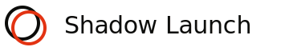

<p align="center">
  
</p>

<h1 align="center">Shadow Launch</h1>

<p align="center">
  <strong>Rehearse the launch before the launch.</strong><br>
  A synthetic market simulator for GTM teams.
</p>

<p align="center">
  <a href="#the-pitch">Pitch</a> ·
  <a href="#how-it-works">How it works</a> ·
  <a href="#the-agents">Agents</a> ·
  <a href="#the-stack">Stack</a> ·
  <a href="#user-journey">Journey</a> ·
  <a href="#project-structure">Structure</a> ·
  <a href="#getting-started">Start</a> ·
  <a href="#design-system">Design</a>
</p>

---

## The pitch

Every launch is a live experiment on customers who did not agree to be the test group. Teams spend six weeks and $30,000 to find out whether their positioning works, then rewrite it after the fact.

Shadow Launch replaces that loop with a two-minute, three-dollar simulation.

Drop in a product URL, two competitor URLs, and an ICP paragraph. Shadow Launch builds a live twin of the market, pressure-tests three narrative wedges against a jury of four synthetic buyer clones, declares a winner with a dissent log, manufactures a Meta ad set for it, and hands back a launch board that a human team can execute against.

No real dollars spent. No real customers used as the test group. The pre-launch *is* the guardrail.

> *The closest real-world analog is a wind tunnel for aircraft or a flight simulator for pilots: you prove the design in a model before you pay the cost of running it live.*

---

## Input and output contract

**Input** (what the user provides):

- Product URL
- Two competitor URLs
- Target ICP description (one paragraph)

**Output** (what Shadow Launch returns):

1. Market twin summary — positioning landscape and underplayed gaps
2. Three candidate narrative wedges, ranked
3. Jury deliberation transcript — four synthetic buyers, twelve reactions
4. Winning wedge with scores and a surviving-dissent log
5. Meta ad creative set, five variants, for the winning wedge
6. A launch board with owners, tasks, and a one-page executive summary

Total wall-clock in demo mode: ~2 minutes.

---

## How it works

```
┌─────────────────────────────────────────────────────────────┐
│                     FRONTEND (Next.js)                       │
│   [ Input Screen ] → [ Live Run View ] → [ Results Page ]    │
└──────────────────────────┬──────────────────────────────────┘
                           │  SSE event stream
┌──────────────────────────▼──────────────────────────────────┐
│              ORCHESTRATOR (Python, FastAPI)                  │
│                    Kalibr routing layer                      │
└──┬──────────┬──────────┬──────────┬──────────┬─────────────┘
   │          │          │          │          │
┌──▼──┐   ┌──▼──┐   ┌──▼──┐    ┌──▼──┐    ┌──▼──┐
│APIFY│   │MINDS│   │CLAUDE│   │PIXERO│   │RORY │
│Twin │   │Jury │   │Brain │   │Media │   │Plan │
└─────┘   └─────┘   └─────┘    └─────┘    └─────┘
```

Every stage emits events on a shared bus. The frontend subscribes and renders the trace live — that is how a two-minute run feels cinematic instead of silent.

### Data flow

```
User input
   │
   ▼
Scout         ──►  market_twin.json    (positioning map, gaps, sources)
   │
   ▼
Cartographer  ──►  wedges[]            (3 angles, each with evidence)
   │
   ▼
Clerk         ──►  deliberation.json   (4 jurors × 3 wedges = 12 reactions,
                                        consensus vector, dissent log)
   │   select winning wedge
   ▼
Producer      ──►  ads[]               (5 Meta variants)
   │
   ▼
Scribe        ──►  launch_board        (owners, tasks, executive summary)
```

---

## The agents

Five logical agents. Each has one job. All orchestrated by Kalibr with retry and fallback baked in.

| Agent           | Role                                              | Primary Tool            | Model                                  |
|-----------------|---------------------------------------------------|-------------------------|----------------------------------------|
| **Scout**       | Build the market twin from the public web         | Apify (6 actors, fan-out) | Claude Sonnet for summarization        |
| **Cartographer**| Surface 3 narrative wedges from the twin          | Claude Sonnet           | —                                      |
| **Clerk**       | Convene the jury, run the deliberation            | Minds AI                | Minds clones + Claude for facilitation |
| **Producer**    | Turn the winning wedge into ads                   | Pixero API              | —                                      |
| **Scribe**      | Assemble the launch board and summary             | Rory API                | Claude Sonnet for summary prose        |

### The jury, specifically

Four composite buyer clones, one per archetype:

- **Champion** — weight 0.20
- **Economic Buyer** — weight 0.35
- **Technical Blocker** — weight 0.25
- **Skeptic** — weight 0.20

Each clone is built from a corpus assembled by Apify: LinkedIn posts and articles from real people in those roles in the target industry. Clones do not represent individuals; they represent archetypes composited from many voices. That is the consent and safety story.

Each clone sees all three wedges and returns an in-character reaction plus a score from -1.0 to +1.0. A weighted consensus picks the winner. Surviving objections — the ones that did not disappear even after the wedge won — flow into the launch board as risks the team must still prepare for.

---

## The stack

Every sponsor tool does load-bearing work. None are decorative.

### Apify — Research Department

Multiple actors chained into a single pipeline builds the market twin. Diversity of sources is the honesty signal:

- Website Content Crawler — product + competitor pages
- Google Search Results Scraper — category discourse
- Reddit Scraper — category complaints and desires
- LinkedIn Jobs Scraper — competitor hiring signals (what they are building)
- G2 / Capterra review scraper — sentiment and feature gaps
- Twitter / X Scraper — live voice of the market

### Minds AI — Voice Department

The jury. High-fidelity personas in dialogue, used not as a chatbot but as a deliberative body with weighted votes and a dissent log. This is the use case Minds AI's own marketing does not show, which is exactly why it lands.

### Pixero — Media Department

Takes the winning wedge as a URL + positioning brief and returns five Meta ad variants. URL-in, campaign-out — but fed a *pre-validated* wedge rather than a cold URL.

### Kalibr — Operations, the nervous system

Every inter-agent LLM call routes through Kalibr:

- Thompson Sampling selects the cheapest model that succeeds at each task (~12x cost reduction, zero quality loss)
- Retry on timeout, fallback to a cheaper path on failure
- Every routing decision surfaces in the trace panel ("rerouted 4, recovered 4, no human intervention")

Kalibr's value is visible in a trace, not a screen. We make that trace a first-class piece of the UI.

### Rory — Mission Control

At the end of a run, Scribe calls Rory to assemble a launch board: 8–12 tasks with owners, a timeline, and a one-page executive summary. This is the hand-off — from agent output to human execution.

---

## User journey

A founder with a B2B SaaS product walks up and does this:

1. **Paste.** Product URL + 2 competitors + ICP. Click *Run Shadow Launch*.
2. **Watch the twin assemble.** A live trace panel shows Apify actors firing across the target market. 60–90 seconds in demo.
3. **Wedge discovery.** Three narrative angles surface, each with an evidence trail back into the twin.
4. **Jury deliberation.** Four synthetic buyer clones debate the wedges. Objections roll in live. One wedge converges fastest.
5. **Campaign manufacture.** Winning wedge flows into Pixero. Ads come back.
6. **Launch plan.** A Rory-style board appears: owners, tasks, executive summary.
7. **Export.** One click. A shareable public results page and a Notion-or-Rory board.

---

## Data model

Kept deliberately flat. State lives in memory per run and persists as JSON files keyed by `run_id` — no database.

```python
Run {
    run_id: str
    created_at: datetime
    input: RunInput
    twin: MarketTwin
    wedges: list[Wedge]           # always len 3
    deliberation: Deliberation
    winner: WedgeVerdict
    ads: list[AdVariant]          # always 5
    launch_board: LaunchBoard
    trace: list[TraceEvent]       # event log for UI
    kalibr_events: list[KalibrEvent]
}
```

Full schema: [`specs.md` §5](specs.md).

---

## Project structure

```
shadow-launch/
├── assets/                    # logo, favicon, brand marks
│   ├── logo-mark.svg
│   ├── logo.svg
│   ├── logo-paper.svg
│   ├── favicon.svg
│   ├── favicon-32.svg
│   └── favicon-16.svg
├── docs/
│   ├── design.md              # design system (v0.1)
│   └── features.md            # feature checklist mapped to spec
├── web/                       # Next.js frontend (planned)
│   ├── app/
│   │   ├── page.tsx           # landing + input
│   │   ├── run/[id]/page.tsx  # live run view
│   │   └── results/[id]/page.tsx
│   └── components/            # TracePanel, StageCard, JuryRoom, ...
├── api/                       # FastAPI orchestrator (planned)
│   ├── main.py
│   ├── orchestrator.py        # Kalibr-wrapped agent graph
│   ├── agents/
│   │   ├── scout.py
│   │   ├── cartographer.py
│   │   ├── clerk.py
│   │   ├── producer.py
│   │   └── scribe.py
│   └── models.py              # Pydantic
├── cache/                     # pre-baked demo runs (JSON)
├── shadow-launch.html         # homepage reference implementation
├── agent.py                   # minimal Kalibr router smoke test
├── specs.md                   # build spec
└── README.md
```

> **Status note.** This repo is the hackathon build surface. The homepage reference (`shadow-launch.html`) and design system are complete. The agent graph (`api/`) and frontend (`web/`) are being lifted from the reference into production scaffolding during the build window. See [`docs/features.md`](docs/features.md) for live status per feature.

---

## Getting started

### Prerequisites

- Python 3.11+
- Node 20+ (for the Next.js frontend, once scaffolded)
- Accounts on: Apify, Minds AI, Pixero, Kalibr, Rory
- Anthropic API key

### Environment

Copy `.env.example` (coming) to `.env` and fill in:

```
# LLM
ANTHROPIC_API_KEY=sk-ant-...

# Routing
KALIBR_API_KEY=sk_...
KALIBR_TENANT_ID=...

# Agents
APIFY_TOKEN=apify_api_...
MINDS_API_KEY=...
PIXERO_API_KEY=...
RORY_API_KEY=...
```

### Install and run the smoke test

```bash
pip install kalibr anthropic
python agent.py
```

This exercises the Kalibr Router against a trivial "extract company name" task across two candidate models. If it prints a response and reports success, your credentials are live.

### View the homepage locally

```bash
# any static server works
python -m http.server 8000
# then open http://localhost:8000/shadow-launch.html
```

---

## Design system

The entire visual language is documented in [`docs/design.md`](docs/design.md). The short version:

- **Aesthetic:** field manual meets scientific instrument. Authoritative, instrumental, warm.
- **Palette:** paper `#ece4d2`, ink `#0c0c0a`, one accent `#e33312`. No white. Ever.
- **Type:** Fraunces (display + prose) and JetBrains Mono (technical readouts). Italic is the emphasis tool, not bold.
- **Layout:** 96px vertical rhythm, alternating paper bands, one dark section per page.
- **Components:** eleven reusable patterns — Trace Bar, Readout Panel, Stamp, Section Head, Step Grid, Juror Card, Wedge Viz, Stack Grid, Watermark CTA, Ghost Typography, Nav.
- **Lexicon is the product.** Run, wedge, jury, juror, deliberation, twin, trace — never "session", "hypothesis", "persona", "log".

Rejected on sight: purple gradients, glassmorphism, rounded friendly sans-serif marketing voice, neon cyberpunk "AI agent" tropes, stock isometric robots, "AI-powered" as an adjective.

### The logo mark

Two overlapping circles: an ink outline and an accent outline, offset, blended via `mix-blend-mode: multiply`. The "shadow" idea made geometric. Source: [`assets/logo-mark.svg`](assets/logo-mark.svg).

---

## Why Kalibr (and the hardcoded-model problem)

Most agent code hardcodes GPT-4o for everything. Simple tasks get priced like hard tasks. Margins bleed.

In Shadow Launch, every inter-agent call routes through Kalibr. Summarization tasks end up on Haiku. Wedge reasoning stays on Sonnet. Jury facilitation rides whichever path is succeeding that minute. The router learns the cost/quality frontier per task from actual outcomes — no manual retuning.

Pattern we use everywhere:

```python
import kalibr                       # must be first import
from kalibr import Router

router = Router(
    goal="surface_wedges",                                # descriptive task name
    paths=["claude-sonnet-4-20250514", "gpt-4o"],         # always 2+ paths
    success_when=lambda out: _validates_wedge_schema(out) # or router.report() manually
)

response = router.completion(messages=[...])
```

Credentials live in `.env`. Full pattern is documented in `CLAUDE.md` for agent contributors.

---

## Demo safety playbook

Because the demo must not rely on a live run finishing in 2 minutes on stage:

- **Lane A (default).** A pre-cached run on a hero company (Linear / Ramp / Granola) loads in 3 seconds and animates to look live.
- **Lane B (flex).** A real run against a volunteer company, for Q&A.

Layered fallbacks, from live API to an offline `.mp4` narrated from a phone. If Apify rate-limits, we load the cached twin. If Minds is slow, we stream a cached transcript with the same artificial delay. If the laptop dies, the video plays from a phone. Every failure mode has a documented fall-through — see [`specs.md` §8](specs.md).

---

## Built for

**Marketing Agents Hackathon · Entrepreneurs First SF · 04.18.26**

Prize track targets:

1. **Best Use of Minds AI** — primary. The jury-as-product framing is deeper than any other use of Minds today.
2. **Best Use of Apify** — multi-actor chained pipeline with visible trace.
3. **Best Organic Social Media Automation (Pixero)** — ads fed a pre-validated wedge.
4. **Overall** — category-defining narrative, not a feature.

---

## Roadmap (post-hackathon)

1. Waitlist on `shadowlaunch.so`.
2. Five design-partner runs against real B2B companies. Publish the anonymized wedge discoveries as content.
3. Lane B: real-customer clones with explicit opt-in and a revenue-share if the clone closes a deal.
4. Integration depth: LinkedIn Ads, HubSpot export, Salesforce opportunity stage mapping.
5. Dark mode — deliberately held back. The paper-and-ink identity is the brand.

---

## Links

- **Homepage reference:** [`shadow-launch.html`](shadow-launch.html)
- **Spec:** [`specs.md`](specs.md)
- **Design system:** [`docs/design.md`](docs/design.md)
- **Feature checklist:** [`docs/features.md`](docs/features.md)
- **Demo (primary):** https://shadowlaunch.ayushojha.com
- **Demo (backup):** https://shadow-launch.vercel.app

---

## Author

**Ayush Ojha** — [ayushozha@outlook.com](mailto:ayushozha@outlook.com) · [linkedin.com/in/ayushozha](https://linkedin.com/in/ayushozha)

Built in one 5-hour window for the Marketing Agents Hackathon at Entrepreneurs First SF.

---

<p align="center">
  <em>Rehearse the launch, before the launch.</em>
</p>
